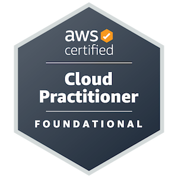
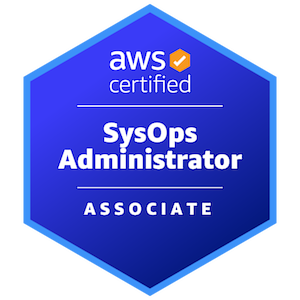
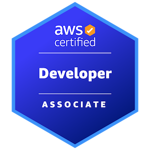
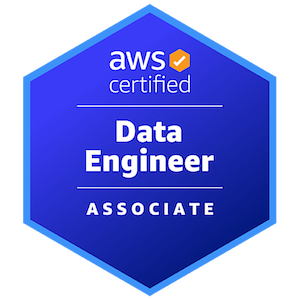
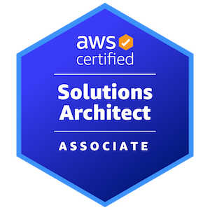

# CV

You can download or view my latest CV [here](../../assets/cv/pdf/cv_latest.pdf).

Expertise in **Python**, **SQL** and **Infrastructure as Code** as well as **Airflow**, **Bash**, **Testing**, **dbt**, **Databases**, **Docker**, **API**s and **Spark**.
I like to _design solutions_ (from _networking_ and _permissions_ through to _app development_) and then implement with best practices.
I am keen to learn new tools and develop on the ones I already have.

---

## Certifications

Check out my current valid _certifications_.

---

## Work Experience
### Technical Experience

#### [Hard Rock Digital](https://www.hardrockdigital.com)

*Data Engineer (Remote) / Jan 2025 – present*  

- **Optimising and Refactoring Suboptimal Processes**
    - Refactored and optimised various **[Airflow](https://airflow.apache.org) DAG**s to adhere to best practices, improving the efficiency of **DAG** _parsing_ and _debugging_. 
    - Fixed _critical bugs_ in several scripts and ensuring proper development environments were in place.
    - Started the creation of _documentation_ in **DBT Cloud**, utilising unit and data tests for audit purposes and unit testing of **DAG** code.
    - Responsible for creating _regulatory reports_ and _optimising_ various **SQL**s for efficiency in **Snowflake**.
    - Designed and built out in **Terragrunt** / **Terraform** the new gambling _self-exclusion_ pipeline.

#### [MarketCast](https://marketcast.com)

*Senior Cloud Engineer (Hybrid) / November 2023 – January 2025*  

- **Designing and Implementing the Survey Database Solution**
    - As part of the _data architecture_ team, I scoped, designed and implemented our new _data warehouse_ solution for survey data.
      The current _file-based_ architecture was limiting use cases and our ability to do further look-backs for historical _normative_ calculations.
    - Utilised **AWS CDK**/**CloudFormation** for the deployment (including several event-based **Lambdas** and **ECS** for processing the surveys).
      Used **Redshift** for the _warehouse_ solution and **dbt** for modelling **ELT** layers within the database, orchestrated through **AWS MWAA**.
    - Developed a _table design_ to preserve the metadata in the survey **SPSS**/**SAV** files and for ease of metadata filtering.
    - Built a generalised **API** with **API Gateway**, **Route53** and **FastAPI** for database access and aggregation calculations for dashboards.
    - Implemented proper logging and alerting via **SNS**, **CloudWatch** and **SQS** for error catching / retries between services.
    - Integrating the database with _data science_ **ML API**s to enrich the survey data.
    - Created a standard for _networking_ across the data architecture team, which was approved by our **AWS** account _solution architects_.
    - Collaborated with teams in the **US** and **India** to incorporate this new survey database into the backend of our new product offerings.
      The database is currently powering new product dashboards and various products we have migrated.
    - Utilising **Redshift** as our _data warehouse_ has allowed us to calculate _normative values_ going back years, not just months, in seconds.
      It has allowed us to consolidate duplicate products which all had similar architectures, reducing **AWS** costs by _thousands per month_.
    - Involved **AWS** in discussions as part of **MAP** program to help ensure best practice and design patterns for this architecture.

*Data Engineer / Scientist (Hybrid) / April 2021 – November 2023*  

- **Automating and Optimising our Attribution Engine**
    - Singularly designed and implemented full end-to-end system for **Excel** report generation from client requests in **JIRA**.
    - Utilised **GPU**s for _nearest-neighbour_ **ML** algorithm, **CTAS** for **Athena** _query optimisations_ and **VPC** optimisations (**NAT** and _endpoints_).
    - Optimised various **SQL** queries to reduce data scan and execution time and migrated **Redshift** queries to **Athena**.
    - Used _memory profiling_ ([memray](https://github.com/bloomberg/memray)) to track memory usage of jobs to gather training data for an **ML** model to _predict memory usage_.
    - The above had significantly improved the reliability of client deliverables, reduced their delivery time and freed up resources.
    - Moreover, we were able to _reduce the cost_ of running a report down to a _few hundred pounds_ from _multiple thousand pounds_.

- **Cost Savings, Technical Support and Implementation of Best Practices**
    - Working with the **SVP** of _Technical Architecture_ to help reduce our organisations **AWS** account costs.
    - Point of contact for **AWS IAM** permission issues, **BitBucket** access and **Okta** through having _admin_ access.
    - Defined best practices for code development, unit testing, **IaC** and **CI**/**CD** deployments across the _data science_ team.
    - Implemented the _principle of least privilege_ to roles in our _production_ accounts.
    - Conducted _knowledge sharing sessions_ for upskilling the team, based on specific gaps in knowledge.
    - Refactored a suboptimal **ETL** pipeline for our TV viewing data, reducing **EC2** costs by _25%_ and execution time from _hours to minutes_ (**PySpark** from **Pandas**).

- **Other Things Of Note**
    - Designed and implemented a pipeline for **A+E** for detecting _ageism_ in advertising.
      This involved ingesting thousands of `.mp4` assets through **AWS Rekognition** and **AWS Transcribe** using an event-based and queueing schedule (i.e. **SNS**, **SQS** and **Lambda**).
      The resulting output was queried within **Athena** for analysis. 
      See the _blog post_ [here](https://www.mediavillage.com/article/ae-research-why-older-adults-matter-to-advertisers/print/).

### Non-Technical Experience

#### [LCC Learning](https://www.lcc-learning.com)

*Mathematics Writer (Temporary) / October 2020*  

#### [Pimlico Academy](https://www.pimlico.futureacademies.org)

*Mathematics Intervention Tutor / January 2020 – July 2020*  

#### [Imperial College London](https://www.imperial.ac.uk)

*Graduate Teaching Assistant (Mathematics) / September 2019 – January 2020*

#### [University of Bath](https://marketcast.com)

*Mathematics Senior Peer Tutor / August 2018 – May 2019*  
*Mathematics First Year Tutor / September 2017 – May 2019*  
*Mathematics Peer Tutor / September 2016 – May 2019*

## Education

### University

_Masters in Mathematics_, **MMath**. 
[_University of Bath_](https://www.bath.ac.uk) attended from **September 2015** to **July 2019**. 
Awarded _first class honours_ (88%).

I specialised in functional analysis and my _thesis_ is [here](../../assets/cv/pdf/math_thesis.pdf).

### Pre-University

**A-Levels** in _Mathematics_, _Further Mathematics_ and _Chemistry_. 
[_Gravesend Grammar School_](https://gravesendgrammar.com) attended from **September 2013** to **July 2015**. 
Awarded A\*A\*A\*.

**GCSEs**. 
[_Thamesview School_](https://www.thamesviewsch.co.uk) attended from **September 2008** to **July 2013**. 
Awarded 8 **GCSE**s grade A\*-C and 3 **BTEC**s of grade _Distinction_.
